# README

## 1.Architecture

#### Three layer **framework, consist of** four projects

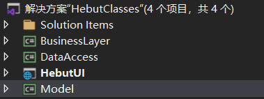

### **1\)Model layer: save all the entities**

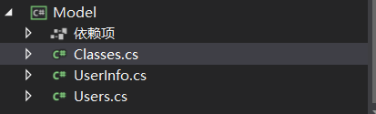

* Classes and Users are models, which are used to migrate database
* UserInfo and Classes used in all the layers as objects

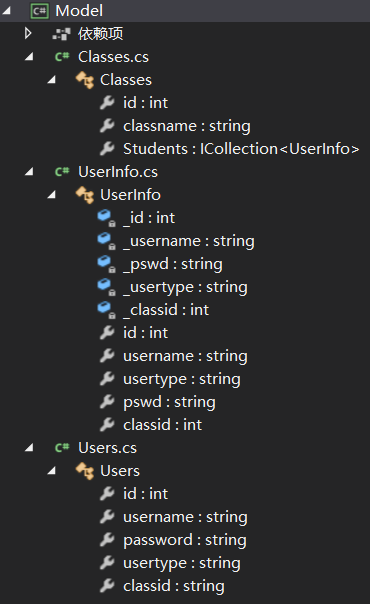

### **2\)DataAccessLayer**

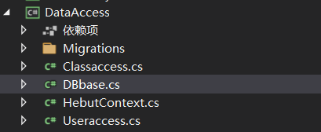

**DBbase:** create and check the connection to the sqlite database

**HebutContext:** config the Creation of the Database from the entity

**Useraccess and Classaccess**: manage the data of users and classes in the database

### **3\)BusinessLayer**

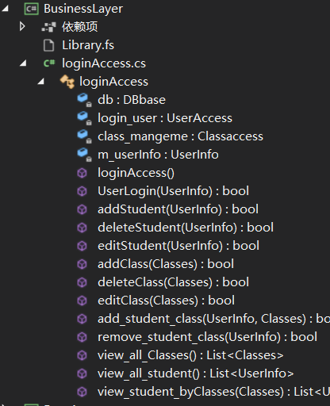

**manage the students and classes through the DAL**

### **4\)HebutUI**

using the MVC archieve

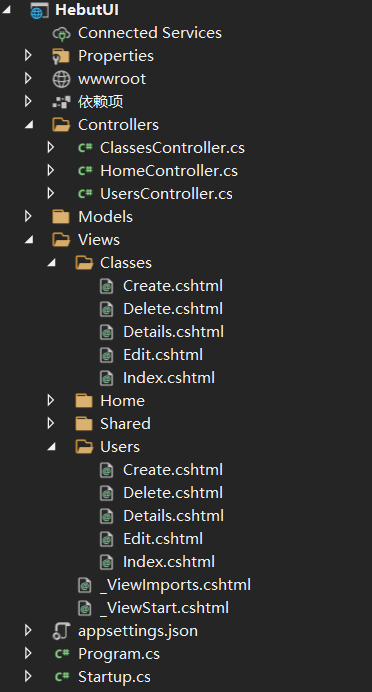

**Create Controllers by models**

## 2.Reference

UI layer: Business layer, Model

Business layer: DAL, Model

DAL: Model

## 3.Function

### permission:

In Business layer, through the loginAccess class, the user will first login or become a user and the account type will be saved in the database, and when he/she manage the students and classes, the system will first check the permission.

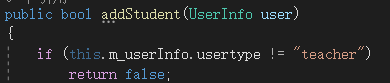

### the pages

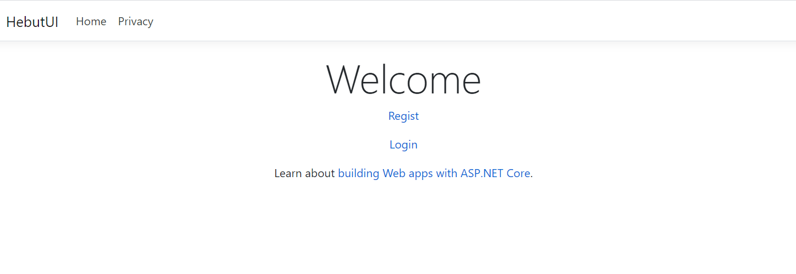

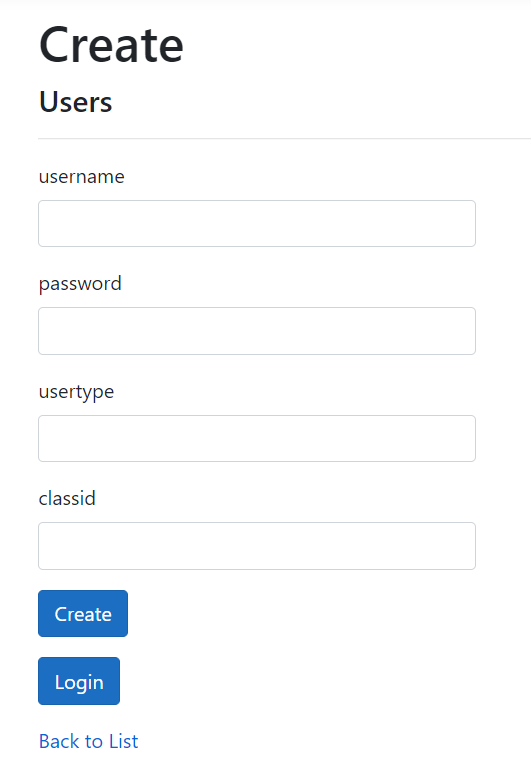

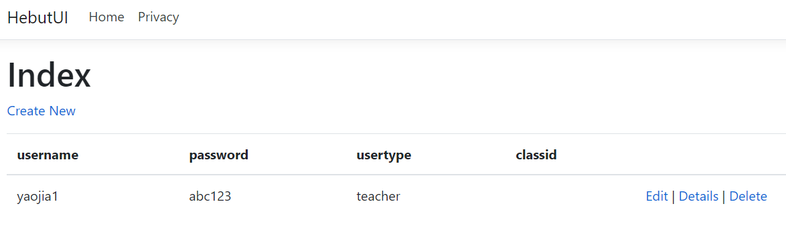

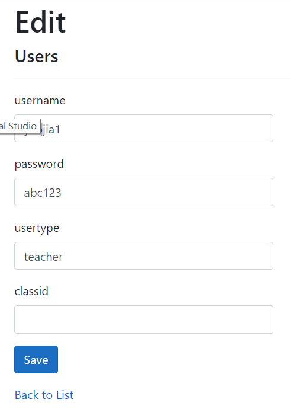

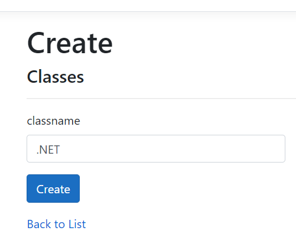

## 

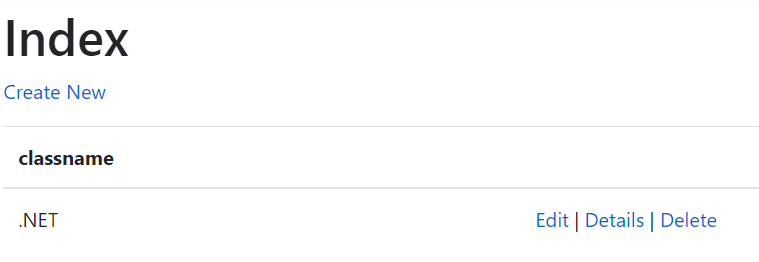

## 

