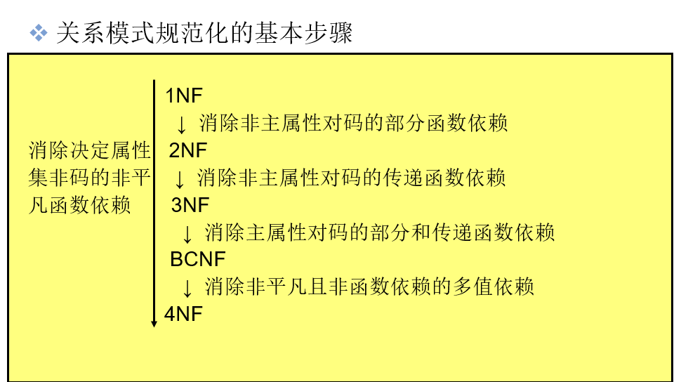
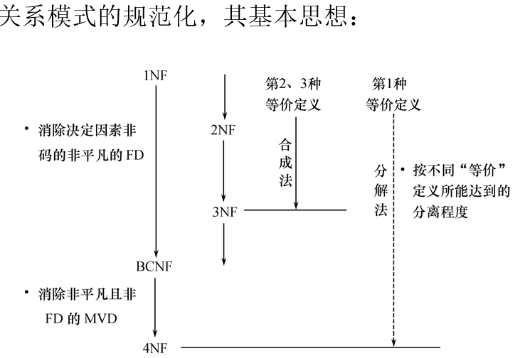

# 第六章 关系数据理论

## 6.1 问题的提出

### 一、概念回顾

关系

关系模式

关系数据库

关系数据库的模式

### 二、关系模式的形式化定义

关系模式由五部分组成，即它是一个五元组：

                    R\(U, D, DOM, F\)

R：      关系名

U：       组成该关系的属性名集合

D：       属性组U中属性所来自的域

DOM： 属性向域的映象集合

F：       属性间数据的依赖关系集合

### 三、什么是数据依赖

1.完整性约束的表现形式

* 限定属性取值范围：例如学生成绩必须在0-100之间 
* 定义属性值间的相互关连（主要体现于值的相等与否），这就是数据依赖，它是数据库模式设计的关键

2.数据依赖

* 一个关系内部属性与属性之间的约束关系 
* 现实世界属性间相互联系的抽象 
* 数据内在的性质 
* 语义的体现

3.数据依赖的类型

* 函数依赖（Functional Dependency，简记为FD） 
* 多值依赖（Multivalued Dependency，简记为MVD）
* 其他

### 四、关系模式的简化定义 

~~关系模式R（U, D, DOM, F）~~

由于D、DOM与模式设计关系不大，本章简化为一个三元组：**R（U, F）**

当且仅当U上的一个关系r满足F时，r称为关系模式 R（U, F）的一个关系

### 五、数据依赖对关系模式影响

属性组U上的一组函数依赖F：

    F ＝｛ Sno → Sdept,  Sdept → Mname,  \(Sno, Cno\) → Grade ｝

#### 1.数据冗余太大

浪费大量的存储空间l每一个系主任的姓名重复出现，重复次数与该系所有学生的所有课程成绩出现次数相同。

#### 2. 更新异常（Update Anomalies）

数据冗余 ，更新数据时，维护数据完整性代价大。l某系更换系主任后，必须修改与该系学生有关的每一个元组。

#### 3. 插入异常（Insertion Anomalies）

    如果一个系刚成立，尚无学生，则无法把这个系及其系主任的信息存入数据库。

#### 4. 删除异常（Deletion Anomalies）

     如果某个系的学生全部毕业了， 则在删除该系学生信息的同时，把这个系及其系主任的信息也丢掉了。

#### 结论：

* Student关系模式不是一个好的模式。
* “好”的模式：

  不会发生插入异常、删除异常、更新异常，

  数据冗余应尽可能少

* 原因：由存在于模式中的某些数据依赖引起的
* 解决方法：通过分解关系模式来消除其中不合适的数据依赖

#### 分解关系模式

把这个单一模式分成3个关系模式：

     S（Sno，Sdept，Sno → Sdept）;

     SC（Sno，Cno，Grade，（Sno，Cno） → Grade）;

     DEPT（Sdept，Mname，Sdept→ Mname）

    这三个模式都不会发生插入异常、删除异常的问题，数据的冗余也得到了控制。

## 6.2 规范化

规范化理论正是用来改造关系模式，通过分解关系模式来消除其中不合适的数据依赖，以解决插入异常、删除异常、更新异常和数据冗余问题。

### 6.2.1  函数依赖

#### 函数依赖 

定义6.1   设R\(U\)是一个属性集U上的关系模式，X和Y是U的子集。

    若对于R\(U\)的任意一个可能的关系r，r中不可能存在两个元组在X上的属性值相等， 而在Y上的属性值不等， 则称 “X函数确定Y” 或  “Y函数依赖于X”，记作X→Y。 

#### 平凡函数依赖与非平凡函数依赖 

在关系模式R\(U\)中，对于U的子集X和Y，

如果X→Y，但Y 不属于 X，则称X→Y是非平凡的函数依赖

若X→Y，但Y 属于X,   则称X→Y是平凡的函数依赖

若X→Y，则X称为这个函数依赖的决定属性组，也称为决定因素（Determinant）。 

若X→Y，Y→X，则记作X←→Y。 

若Y不函数依赖于X，则记作X\→Y。

#### 完全函数依赖与部分函数依赖 

> 定义6.2  在R\(U\)中，如果X→Y，并且对于X的任何一个真子集X’，都有X’   不决定 Y, 则称Y对X完全函数依赖，记作
>
>      X F→Y。

> 若X→Y，但Y不完全函数依赖于X，则称Y对X部分函数依赖，记作X  P→ Y。

\(Sno,Cno\)→Grade是完全函数依赖，

\(Sno,Cno\)→Sdept是部分函数依赖

因为Sno →Sdept成立，且Sno是（Sno，Cno）的真子集

#### 传递函数依赖

定义6.3  在R\(U\)中，如果X→Y，\(Y ÍX\) ,Y→X Y→Z， 则称Z对X传递函数依赖。

    记为：X → Z

 注: 如果Y→X， 即X←→Y，则Z直接依赖于X。

### 6.2.2  码

定义6.4  设K为R&lt;U,F&gt;中的属性或属性组合。若K      U，  则K称为R的侯选码（Candidate Key）。

     若候选码多于一个，则选定其中的一个做为主码（Primary Key）。

超键码：包含键码的属性集，每个候选码都是超键码，但是某些超键码不是候选码。

主属性与非主属性  

* 包含在任何一个候选码中的属性 ，称为主属性（Prime attribute）
*  不包含在任何码中的属性称为非主属性（Nonprime attribute）或非码属性（Non-key attribute）

全码 整个属性组是码，称为全码（All-key）

### 6.2.3  范式

范式是符合某一种级别的关系模式的集合v

关系数据库中的关系必须满足一定的要求。满足不同程度要求的为不同范式v

范式的种类： 

* 第一范式\(1NF\)
* 第二范式\(2NF\)
* 第三范式\(3NF\)
* BC范式\(BCNF\)
* 第四范式\(4NF\)   
* 第五范式\(5NF\)

各种范式之间存在联系：

某一关系模式R为第n范式，可简记为R∈nNF。 

**一个低一级范式的关系模式，通过模式分解可以转换为若干个高一级范式的关系模式的集合，这种过程就叫规范化**

### 6.2.4  2NF

#### 1NF

**如果一个关系模式R的所有属性都是不可分的基本数据项，则R∈1NF**

**若R∈1NF，且每一个非主属性完全函数依赖于码，则R∈2NF。**

### 6.2.5  3NF

**若R∈3NF，则每一个非主属性既不部分依赖于码也不传递依赖于码。**

定义6.7  关系模式R&lt;U，F&gt; 中若不存在这样的码X、属性组Y及非主属性Z（Z Í Y）, 使得X→Y，Y→Z成立，

    Y → X，则称R&lt;U，F&gt; ∈ 3NF。

### 6.2.6  BCNF 

v定义6.8   关系模式R&lt;U，F&gt;∈1NF，若X→Y且Y Í X时X必含有码，则R&lt;U，F&gt; ∈BCNF。vv等价于：每一个决定属性因素都包含码v若X→Y且Y Í X, X→Y则为非平凡函数依赖

  BC范式的另外一种表述：每个非平凡函数依赖的左边必须包含键码（超键码）

若R∈BCNF 所有非主属性对每一个码都是完全函数依赖 所有的主属性对每一个不包含它的码，也是完全函数依赖 没有任何属性完全函数依赖于非码的任何一组属性

R ∈BCNF充分不必要 R ∈3NF 

任何双属性关系都属于BCNF（证明略）

如果R∈3NF，且R只有一个候选码

R ∈BCNF      充分必要       R ∈3NF

3NF和BCNF是在函数依赖的条件下对模式分解所能达到的分离程度的测度。 

* 一个模式中的关系模式如果都属于BCNF，那么在函数依赖范畴内，它已实现了彻底的分离，已消除了插入和删除的异常。
* 3NF的“不彻底”性表现在可能存在主属性对码的部分依赖和传递依赖

### 6.2.7  规范化小结

* 不能说规范化程度越高的关系模式就越好 
* 在设计数据库模式结构时，必须对现实世界的实际情况和用户应用需求作进一步分析，确定一个合适的、能够反映现实世界的模式 
* 上面的规范化步骤可以在其中任何一步终止

## 6.3 数据依赖的公理系统

逻辑蕴含

> 定义6.11  
>
> 对于满足一组函数依赖 F 的关系模式R &lt;U，F&gt;，其任何一个关系r，若函数依赖X→Y都成立, （即r中任意两元组t，s，若t\[X］=s\[X］，则t\[Y］=s\[Y］），则称F逻辑蕴含X →Y

###   Armstrong公理系统

关系模式R 来说有以下的推理规则：

1.  A1.自反律（Reflexivity）：若Y &lt;= X &lt;= U，则X →Y为F所蕴含。 
2. A2.增广律（Augmentation）：若X→Y为F所蕴含，且Z &lt;= U，则XZ→YZ为F所蕴含。 
3. A3.传递律（Transitivity）：若X→Y及Y→Z为F所蕴含，则X→Z为F所蕴含。

### 导出规则

\(1\) 根据A1，A2，A3这三条推理规则可以得到下面三条推理规则：

        § 合并规则：由X→Y，X→Z，有X→YZ。（A2， A3）

        § 伪传递规则：由X→Y，WY→Z，有XW→Z。（A2， A3）

        § 分解规则：由X→Y及 Z&lt;=Y，有X→Z。（A1， A3）

\(2\) 根据合并规则和分解规则，可得引理6.1

   引理6.l  X→A1 A2…Ak成立的充分必要条件是X→Ai成立（i=l，2，…，k）

### 函数依赖闭包

定义6.l2    在关系模式R&lt;U，F&gt;中为F所逻辑蕴含的函数依赖的全体叫作 F的闭包，记为F+。

定义6.13   设F为属性集U上的一组函数依赖，X ÍU， XF+ ={ A\|X→A能由F 根据Armstrong公理导出}，XF+称为属性集X关于函数依赖集F 的闭包

引理6.2 

   设F为属性集U上的一组函数依赖，X，Y &lt;=U，X→Y能

   由F 根据Armstrong公理导出的充分必要条件是Y &lt;=XF+

用途

    将判定X→Y是否能由F根据Armstrong公理导出的问题，转化为求出XF+ 、判定Y是否为XF+的子集的问题

## 6.4 模式的分解

* 关系模式R&lt;U,F&gt;的一个分解 ρ={ R1&lt;U1,F1&gt;，R2&lt;U2,F2&gt;， …，Rn&lt;Un,Fn&gt;}
* 若R与R1、R2、…、Rn自然连接的结果相等，则称关系模式R的这个分解ρ具有无损连接性（Lossless join）v
* 具有无损连接性的分解保证不丢失信息v
* 无损连接性不一定能解决插入异常、删除异常、修改复杂、数据冗余等问题
* 如果一个分解具有无损连接性，则它能够保证不丢失信息 
* 如果一个分解保持了函数依赖，则它可以减轻或解决各种异常情况 
* 分解具有无损连接性和分解保持函数依赖是两个互相独立的标准。具有无损连接性的分解不一定能够保持函数依赖；同样，保持函数依赖的分解也不一定具有无损连接性。

### 分解算法

#### 算法6.2 判别一个分解的无损连接性 

无损连接分解的特性说明： 关系模式分解后所表示的信息应与原模式等价， 即分解后的多个关系再连接得到的新关系不能“丢失”信息。 实际上， 连接后的关系不会少了任何元组， 而是可能多出一些元组， 因与原来的关系不等价， 所以是有损的。

方法： \(1\) 构造一个k行n列的初始表， 第i 行对应于关系模式Ri， 第j列对应于属性Aj。 如果Aj∈Ri， 则在第i行第j列上填符号aj； 否则填符号bij。  
\(2\) 逐个检查F中的每一个函数依赖， 并修改表中的元素。 具体办法如下： 从函数依赖集F中取一个函数依赖X→Y， 在X的分量中寻找相同的行， 然后将这些行中Y的分量改为相同的符号。 如果其中有aj, 则将bij改为aj; 否则， 改为bij\(指用其中的一个bij替换另一个， 通常是把下标改为较小的那个数\)。

\(3\) 这样反复进行， 如果发现某一行变成了a1, a2, …, an， 即存在某一行全为a 类符号， 则分解ρ具有无损连接性； 如果 F中所有函数依赖都不能再修改表中的内容， 且没有发现这样的行， 则分解ρ不具有无损连接性。

#### 算法6.3（合成法）转换为3NF的保持函数依赖的分解。 

   输入： 关系模式R 和关系模式R的函数依赖F的极小依赖集F′;

   输出： R的一个分解ρ={R1, R2, …, Rn}， Ri为3NF\(i=1, 2,  …, n\)， ρ具有函数依赖保持性。

 方法：        

  \(1\) 如果极小依赖集F′中有一个依赖X→A， 且XA=R， 则输出ρ={R}， 转向\(4\)；

   \(2\) 如果R中某些属性与F′中所有函数依赖的左部和右部都无关， 则将它们构成一个关系子模式Rj ， 并从R中将它们分出去。

\(3\) 对于F′中的每一个Xi→Ai， 都构成一个关系子模式Ri=XiAi；

 \(4\) 停止分解， 输出ρ。

#### 算法6.4 转换为3NF既有无损连接性又保持函数依赖的分解 

输入： 关系模式R和R的极小函数依赖集F′。

输出： R的一个分解ρ={R1, R2, …, Rn}， Ri为3NF（i=1, 2,  …, n）， ρ具有无损连接性和函数依赖保持性。

方法：

    \(1\) 根据算法求出函数依赖保持性分解： ρ={R1, R2, …, Rn}；

   \(2\) 判定ρ是否具有无损连接性， 若具有， 转向\(4\)；

   \(3\) 令ρ＝ρ∪｛X｝， 其中， X是R的一个候选键；

   \(4\) 输出ρ。  

#### 算法6.5 （分解法）转换为BCNF的无损连接分解

输入： 关系模式R和函数依赖集F。

  输出： R的一个无损分解ρ={R1, R2, …, Rn}。

  方法：

 \(1\) 令ρ={R}；

 \(2\) 如果ρ中所有模式都是BCNF， 则转向\(4\)；

 \(3\) 如果ρ中有一个关系模式Ri不是BCNF， 则Ri中必能找到一个函数依赖X→A， A不属于X且X不是Ri的候选键， 因此， 分解Ri为Ri1=XA， Ri2=Ri–A， 并用Ri1和Ri2代替Ri， 转向\(2\);

\(4\) 分解结束， 输出ρ。

     

## 6.5 小结

* 若要求分解具有无损连接性，那么模式分解一定能够达到4NF 
* 若要求分解保持函数依赖，那么模式分解一定能够达到3NF，但不一定能够达到BCNF 
* 若要求分解既具有无损连接性，又保持函数依赖，则模式分解一定能够达到3NF，但不一定能够达到BCNF
* 规范化理论为数据库设计提供了理论的指南和工具 
  * 也仅仅是指南和工具
* 并不是规范化程度越高，模式就越好
  * 必须结合应用环境和现实世界的具体情况合理地选择数据库模式

