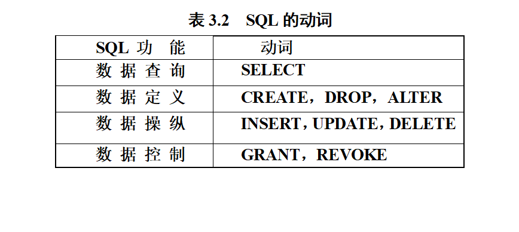

# 数据定义



本身独立存在的表，SQL中一个关系就对应一个基本表；一个\(或多个\)基本表对应一个存储文件。 一个表可以带若干索引。


## 数据定义


## 模式

现代关系数据库管理系统提供了一个层次化的数据库对象命名机制：一个关系数据库管理系统的实例（Instance）中可以建立多个数据库 ； 一个数据库中可以建立多个模式； 一个模式下通常包括多个表、视图和索引等数据库对象

### 模式定义

**`CREATE SCHEMA “S-T” AUTHORIZATION WANG;`**

 为用户WANG定义了一个模式S-T

如果没有指定&lt;模式名&gt;，那么&lt;模式名&gt;隐含为&lt;用户名&gt;

> v定义模式实际上定义了一个命名空间v在这个空间中可以定义该模式包含的数据库对象，例如基本表、视图、索引等。v在CREATE SCHEMA中可以接受CREATE TABLE，CREATE VIEW和GRANT子句。

`CREATE SCHEMA <模式名> AUTHORIZATION <用户名>[<表定义子句>|<视图定义子句>|<授权定义子句>]`

### 模式删除

```text
DROP SCHEMA ZHANG CASCADE；
```

删除模式ZHANG

同时该模式中定义的表TAB1也被删除

## 基本表 

本身独立存在的表；SQL中一个关系就对应一个基本表；一个\(或多个\)基本表对应一个存储文件；一个表可以带若干索引；

### 定义基本表

```text
CREATE TABLE <表名>
  (<列名> <数据类型>[ <列级完整性约束条件> ]      
  [,<列名> <数据类型>[ <列级完整性约束条件>] ]      
  [,<表级完整性约束条件> ] );
```

1. &lt;表名&gt;：所要定义的基本表的名字
2. &lt;列名&gt;：组成该表的各个属性（列）
3. &lt;列级完整性约束条件&gt;：涉及相应属性列的完整性约束条件
4. &lt;表级完整性约束条件&gt;：涉及一个或多个属性列的完整性约束条件

如果完整性约束条件涉及到该表的多个属性列，则必须定义在表级上，否则既可以定义在列级也可以定义在表级。

```text
/*[例3.5]  建立“学生”表Student，学号是主码，姓名取值唯一。*/
     
CREATE TABLE Student          
(Sno   CHAR(9) PRIMARY KEY， /* 列级完整性约束条件*/                  
 Sname  CHAR(20) UNIQUE，     /* Sname取唯一值*/
 Ssex    CHAR(2)，
 Sage   SMALLINT，
 Sdept  CHAR(20)
 )； 
```

#### 约束

主键约束（primary key）和唯一性\(unique\)约束的区别 ：

* 主键约束不可以为空，唯一性约束可以为空

唯一性\(unique\)约束对null值的处理 ：

* SQLserver会认为所有的null是同一值，一个Unique约束下的字段只允许插入一条为null的数据。
*  Oracle对于 一个Unique约束下允许为null的字段，则选择忽略对null的审查，即可插入多条为null的数据

#### 数据类型


### 修改表

```text
ALTER TABLE <表名>
[ ADD[COLUMN] <新列名> <数据类型> [ 完整性约束 ] ]
[ ADD <表级完整性约束>]
[ DROP [ COLUMN ] <列名> [CASCADE| RESTRICT] ]
[ DROP CONSTRAINT<完整性约束名>[ RESTRICT | CASCADE ] ]
[ALTER COLUMN <列名><数据类型> ] ;
```

* &lt;表名&gt;是要修改的基本表 
* ADD子句用于**增加新列**、**新的列级完整性约束条件**和**新的表级完整性约束条件** 
* DROP COLUMN子句用于删除表中的列。如果指定了**CASCADE短语**，则自动删除引用了该列的其他对象 如果指定了**RESTRICT短语**，则如果该列被其他对象引用，关系数据库管理系统将拒绝删除该列 
* DROP CONSTRAINT子句用于**删除指定的完整性约束条件** 
* ALTER COLUMN子句用于修改原有的**列定义**，包括修改列名和数据类型

### 删除表

```sql
DROP TABLE <表名>［RESTRICT| CASCADE］；
```

* RESTRICT：删除表是有限制的。 欲删除的基本表**不能被其他表的约束所引用** 如果存在依赖该表的对象，则**此表不能被删除** 
* CASCADE：删除该表没有限制。 在删除基本表的同时，**相关的依赖对象一起删除（**表上建立的索引、视图、触发器等**）** 

#### DROP TABLE时，SQL2011 与 3个RDBMS的处理策略比较 


## 索引

* 建立索引的目的：加快查询速度
* 谁可以建立索引
  * * DBA 或 表的属主（即建立表的人）
    * DBMS一般会自动建立以下列上的索引
      *  PRIMARY  KEY
      *  UNIQUE
* 谁 
  * 维护索引   ：  DBMS自动完成 
  * 使用索引  ： DBMS自动选择是否使用索引以及使用哪些索引

#### 为什么引入索引

> 数据库最频繁的操作是进行数据查询，如果某表没有索引，那么访问此表时，会对这个表进行扫描，是非常耗时耗资源的一种操作。
>
> 如果有索引，那么可以通过对索引的扫描进行定位，提高读的时间，甚至可以直接从索引取得需要的数据，不再需要读整个表。
>
>  索引是对数据库表中一个或多个列的值进行排序的结构。
>
> 每个索引都有一个特定的搜索码与表中的记录关联，索引按顺序存储搜索码的值。

#### 建立索引

```text
CREATE [UNIQUE] [CLUSTER] INDEX <索引名> 
ON <表名>(<列名>[<次序>][,<列名>[<次序>] ]…);
<表名>：要建索引的基本表的名字
索引：可以建立在该表的一列或多列上，各列名之间用逗号分隔
<次序>：指定索引值的排列次序，升序：ASC，降序：DESC。缺省值：ASC
UNIQUE：此索引的每一个索引值只对应唯一的数据记录
CLUSTER：表示要建立的索引是聚簇索引
```

聚簇索引：  正文内容本身就是一种按照一定规则排列的目录称为“聚簇索引” 

```sql
CREATE CLUSTER INDEX Stusname 
           ON   Student(Sname)；
--在Student表的Sname（姓名）列上建立一个聚簇索引
```

特点：当查询指定了关键值的范围或者按照关键值的排序的顺序访问数据行时，应考虑在对应的列上创建聚簇索引。

*  每个表只能有一个聚簇索引。
*  聚簇索引改变数据的物理排序方式，使得数据行的物理顺序和索引中的键值顺序是一致的。所以，应当在创建任何非聚簇索引之前创建聚簇索引。
*  聚簇索引的大小根据被索引的列的情况有所不同，平均大小是表的5%。
* 经常更新的列不宜建立聚簇索引

非聚簇索引： 目录纯粹是目录，正文纯粹是正文的排序方式称为“非聚簇索引”。 当用户需要使用多种方法查找数据时，非聚簇索引非常有用。

```sql
--[例3.13]为学生-课程数据库中的Student，Course，SC三个表建  立索引。   
CREATE UNIQUE INDEX  Stusno ON Student(Sno)；
CREATE UNIQUE INDEX  Coucno ON Course(Cno)；
CREATE UNIQUE INDEX  SCno ON SC(Sno ASC，Cno DESC)；
    
    /*Student表按学号升序建唯一索引
      Course表按课程号升序建唯一索引
      SC表按学号升序和课程号降序建唯一索引*/
```

* 如果创建索引时没有指定索引类型，默认情况下为非聚簇索引。 
* 应当在创建非聚集索引之前创建聚簇索引。
*  最好在唯一值较多的列上创建非聚簇索引。

#### 修改索引

ALTER INDEX &lt;旧索引名&gt; RENAME TO &lt;新索引名&gt;

```sql
--[例3.14] 将SC表的SCno索引名改为SCSno
  ALTER INDEX SCno RENAME TO SCSno;
```

#### 删除索引

DROP INDEX &lt;索引名&gt;；

删除索引时，系统会从数据字典中删去有关该索引的描述。

```text
--[例3.15]  删除Student表的Stusname索引
	   DROP INDEX Stusname；
```

## 视图

 从一个或几个基本表导出的表 数据库中只存放视图的定义而不存放视图对应的数据 视图是一个虚表 用户可以在视图上再定义视图

