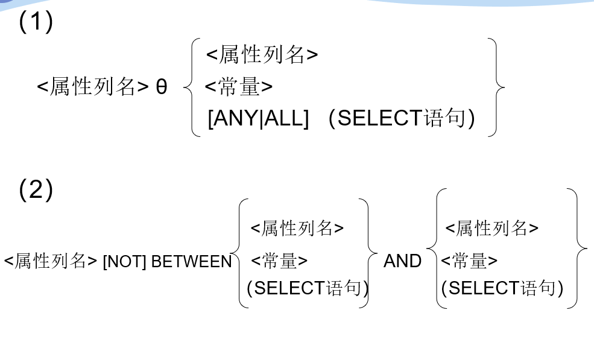
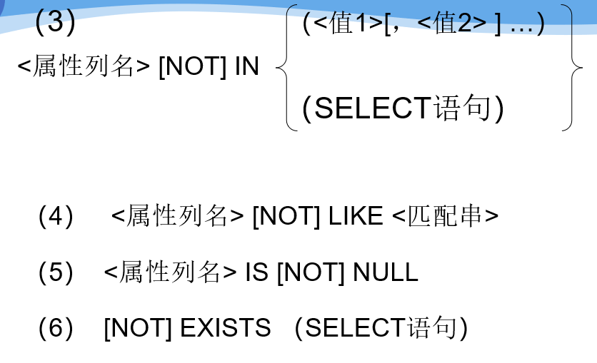
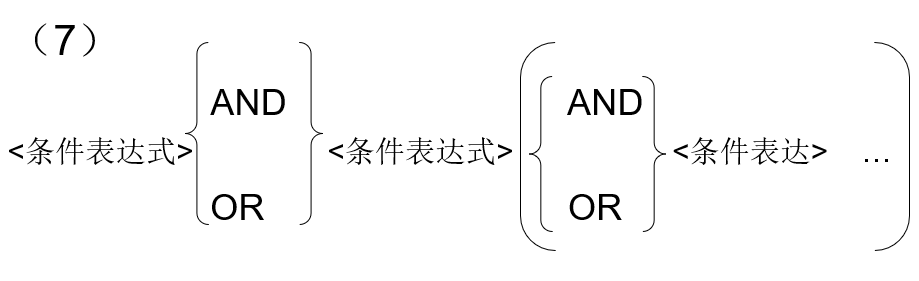

# 数据查询


## 格式

```text
SELECT [ALL|DISTINCT] <目标列表达式>[，<目标列表达式>] …
FROM <表名或视图名>[， <表名或视图名> ] …
[ WHERE <条件表达式> ]
[ GROUP BY <列名1> [ HAVING <条件表达式> ] ]
[ ORDER BY <列名2> [ ASC|DESC ] ]；

```

* SELECT子句：指定要显示的属性列 
* FROM子句：指定查询对象（基本表或视图） 
* WHERE子句：指定查询条件 
* GROUP BY子句：对查询结果按指定列的值分组，该属性列值相等的元组为一个组。通常会在每组中作用聚集函数。 
* HAVING短语：只有满足指定条件的组才予以输出 
* ORDER BY子句：对查询结果表按指定列值的升序或降序排序

## 目录

* 3.4.1 单表查询 
* 3.4.2 连接查询 
* 3.4.3 嵌套查询
*  3.4.4 集合查询 
* 3.4.5 基于派生表的查询 
* 3.4.6 Select语句的一般形式

## 3.4.1单表查询

### 1.1选择表中的若干列 

```text
--查询全体学生的姓名、学号、所在系。
		SELECT Sname，Sno，Sdept
		FROM Student；
```

#### 查询若干列

```text
SELECT Sno，Sname
		FROM Student； 
```

#### 选出所有属性列：

* 在SELECT关键字后面列出所有列名
* 将&lt;目标列表达式&gt;指定为 \*

```text
--[例3.18]  查询全体学生的详细记录。
SELECT  Sno，Sname，Ssex，Sage，Sdept
FROM Student；
--或
SELECT  * FROM Student；
```

#### 查询经过计算的值

SELECT子句的&lt;目标列表达式&gt;可以为： 

* 算术表达式 
* 字符串常量 
* 函数 
* 列别名

```text
使用列别名改变查询结果的列标题:
SELECT 
Sname NAME，'Year of Birth: ’ BIRTH,2000-Sage BIRTHDAY，LOWER(Sdept) DEPARTMENT
	FROM Student；
输出结果：
    NAME      BIRTH         BIRTHDAY   DEPARTMENT
   -------  ----------------    -------------  ------------------
     李勇    Year of Birth:    1984             cs
     刘晨    Year of Birth:    1985             is
     王敏    Year of Birth:    1986             ma
     张立    Year of Birth:    1985             is
```

### 1.2 选择表中的若干元组

消除取值重复的行，如果没有指定DISTINCT关键词，则缺省为ALL

```text
[例3.21]  查询选修了课程的学生学号。
    SELECT Sno   FROM SC；
	等价于：
	SELECT ALL  Sno  FROM SC；
	执行上面的SELECT语句后，结果为： 
					    Sno

					200215121
					200215121
					200215121
					200215122
					200215122
```

指定DISTINCT关键词，去掉表中重复的行

```text
SELECT DISTINCT Sno
    FROM SC； 

    执行结果：
					    Sno

					200215121
					200215122
```

#### 查询满足条件的元组


```sql
/*比较大小*/
--例3.22］  查询计算机科学系全体学生的名单。
    SELECT Sname
    FROM Student
    WHERE Sdept=‘CS’； 
--[例3.23]  查询所有年龄在20岁以下的学生姓名及其年龄。
     SELECT Sname，Sage 
FROM    Student    
WHERE Sage < 20；
--［例3.24］  查询考试成绩有不及格的学生的学号。
    SELECT DISTINCT Sno
    FROM  SC
    WHERE Grade<60；
    
 
   
/*确定范围*/
/*谓词:   BETWEEN …  AND  …
                 NOT BETWEEN  …  AND  …*/
--[例3.25] 查询年龄在20~23岁（包括20岁和23岁）之间的学生的姓名、系别和年龄
SELECT Sname，Sdept，Sage
FROM     Student
WHERE   Sage BETWEEN 20 AND 23； 
--[例3.26]  查询年龄不在20~23岁之间的学生姓名、系别和年龄
	       SELECT Sname，Sdept，Sage
	       FROM    Student
	       WHERE Sage NOT BETWEEN 20 AND 23； 
	
	
	
/*确定集合*/
--谓词：IN <值表>,  NOT IN <值表>          
--[例3.27]查询信息系（IS）、数学系（MA）和计算机科学系（CS）学生的姓名和性别。
	SELECT Sname，Ssex
	FROM  Student
	WHERE Sdept IN ( 'IS'，'MA'，'CS' );
--[例3.28]查询既不是信息系、数学系，也不是计算机科学系的学生的姓名和性别。
SELECT Sname，Ssex
FROM Student
	 WHERE Sdept NOT IN ( 'IS'，'MA'，'CS' );


/*字符匹配*/
--谓词： [NOT] LIKE  ‘<匹配串>’  [ESCAPE ‘ <换码字符>’]
--匹配串为固定字符串
--[例3.29]  查询学号为200215121的学生的详细情况。
     SELECT *    
     FROM  Student  
     WHERE  Sno LIKE '200215121'；
--等价于： 
      SELECT  * 
      FROM  Student 
      WHERE Sno = ' 200215121 '；
--匹配串为含通配符的字符串
--[例3.30]  查询所有姓刘学生的姓名、学号和性别。
      SELECT Sname，Sno，Ssex
      FROM Student
      WHERE  Sname LIKE ‘刘%’；

--[例3.31]  查询姓"欧阳"且全名为三个汉字的学生的姓名。
      SELECT Sname
      FROM   Student
      WHERE  Sname LIKE '欧阳_'；
--[例3.32]  查询名字中第2个字为"阳"字的学生的姓名和学号。
      SELECT Sname，Sno
      FROM Student
      WHERE Sname LIKE ‘__阳%’；

--[例3.33]  查询所有不姓刘的学生姓名。
      SELECT Sname，Sno，Ssex
      FROM Student
      WHERE Sname NOT LIKE '刘%'；

--使用换码字符将通配符转义为普通字符
 
--[例3.34]  查询DB_Design课程的课程号和学分。
      SELECT Cno，Ccredit
      FROM Course
      WHERE Cname LIKE 'DB\_Design' ESCAPE '\'；

--[例3.35]  查询以"DB_"开头，且倒数第3个字符为 i的课程的详细情况。
      SELECT  *
      FROM   Course
      WHERE  Cname LIKE  'DB\_%i_ _' ESCAPE ' \ '；

 ESCAPE '＼' 表示“ ＼” 为换码字符 


/*涉及空值的查询*/
/*谓词： IS NULL 或 IS NOT NULL
 “IS” 不能用 “=” 代替*/
--某些学生选修课程后没有参加考试，所以有选课记录，但没有考试成绩。查询缺少成绩的学生的学号和相应的课程号。
	 SELECT Sno，Cno
      FROM  SC
      WHERE  Grade IS NULL
--查所有有成绩的学生学号和课程号。
      SELECT Sno，Cno
      FROM  SC
      WHERE  Grade IS NOT NULL；
      

 
```

多重查询：

* 逻辑运算符：AND和 OR来联结多个查询条件 
  * AND的优先级高于OR
  * 可以用括号改变优先级
* 可用来实现多种其他谓词
  *  \[NOT\] IN \[NOT\] 
  * BETWEEN … AND …

### 1.3 ORDER BY子句

* ORDER BY子句 
  * 可以按一个或多个属性列排序 
  * 升序：ASC；降序：DESC；缺省值为升序 
* 当排序列含空值时 
  * ASC：排序列为空值的元组最后显示 
  * DESC：排序列为空值的元组最先显示

```sql
--查询选修了3号课程的学生的学号及其成绩，查询结果按分数降序排列。
        SELECT Sno，Grade
        FROM  SC
        WHERE  Cno= ' 3 '
        ORDER BY Grade DESC；
/*多属性*/
--查询全体学生情况，查询结果按所在系的系号升序排列，同一系中的学生按年龄降序排列。
        SELECT  *
        FROM  Student
        ORDER BY Sdept，Sage DESC；  
```

### 1.4 聚集函数

#### 聚集函数

* 计数
  * COUNT（\[DISTINCT\|ALL\] \*）
  * COUNT（\[DISTINCT\|ALL\] &lt;列名&gt;）
* 计算总和
  * SUM（\[DISTINCT\|ALL\] &lt;列名&gt;） 
* 计算平均值
  * AVG（\[DISTINCT\|ALL\] &lt;列名&gt;）
* 最大最小值 
  * MAX（\[DISTINCT\|ALL\] &lt;列名&gt;\)
  * MIN（\[DISTINCT\|ALL\] &lt;列名&gt;）

###  1.5 GROUP BY子句

GROUP BY子句分组：

####  细化聚集函数的作用对象

* 未对查询结果分组，聚集函数将作用于整个查询结果
* 对查询结果分组后，聚集函数将分别作用于每个组
* 作用对象是查询的中间结果表
* 分组方法：按指定的一列或多列值分组，值相等的为一组

#### HAVING短语与WHERE子句的区别： **作用对象不同**

* **WHERE子句作用于基表或视图，从中选择满足条件的元组**  
* **HAVING短语作用于组，从中选择满足条件的组。**

```text
--求各个课程号及相应的选课人数。
     SELECT Cno，COUNT(Sno)
     FROM    SC
     GROUP BY Cno； 
--查询结果：
            Cno        COUNT(Sno)
 			1             22
     		2             34
     		3             44
  			4             33
       		5             48
--查询选修了3门以上课程的学生学号。
     SELECT Sno
     FROM  SC
     GROUP BY Sno
     HAVING  COUNT(*) >3；  
--查询平均成绩大于等于90分的学生学号和平均成绩
--下面的语句是不对的：
    SELECT Sno, AVG(Grade)
    FROM  SC
    WHERE AVG(Grade)>=90
    GROUP BY Sno;
--因为WHERE子句中是不能用聚集函数作为条件表达式
--正确的查询语句应该是：
    SELECT  Sno, AVG(Grade)
    FROM  SC
    GROUP BY Sno
    HAVING AVG(Grade)>=90;

```

## 连接查询

连接查询：同时涉及多个表的查询

连接条件或连接谓词：用来连接两个表的条件

一般格式：

* \[&lt;表名1&gt;.\]&lt;列名1&gt;  &lt;比较运算符&gt;  \[&lt;表名2&gt;.\]&lt;列名2&gt;
* \[&lt;表名1&gt;.\]&lt;列名1&gt; BETWEEN \[&lt;表名2&gt;.\]&lt;列名2&gt; AND \[&lt;表名2&gt;.\]&lt;列名3&gt;v

连接字段：连接谓词中的列名称

连接条件中的各连接字段类型必须是可比的，但名字不必是相同的

### 连接操作的执行过程

#### 嵌套循环法\(NESTED-LOOP\)   

1. 首先在表1中找到第一个元组，然后从头开始扫描表2，逐一查找满足连接件的元组，找到后就将表1中的第一个元组与该元组拼接起来，形成结果表中一个元组。
2. 表2全部查找完后，再找表1中第二个元组，然后再从头开始扫描表2，逐一查找满足连接条件的元组，找到后就将表1中的第二个元组与该元组拼接起来，形成结果表中一个元组。
3. 重复上述操作，直到表1中的全部元组都处理完毕

#### 排序合并法\(SORT-MERGE\)

常用于=连接 

1. 首先按连接属性对表1和表2排序
2. 对表1的第一个元组，从头开始扫描表2，顺序查找满足连接条件的元组，找到后就将表1中的第一个元组与该元组拼接起来，形成结果表中一个元组。当遇到表2中第一条大于表1连接字段值的元组时，对表2的查询不再继续

#### 索引连接\(INDEX-JOIN\)

1. 对表2按连接字段建立索引 
2. 对表1中的每个元组，依次根据其连接字段值查询表2的索引，从中找到满足条件的元组，找到后就将表1中的第一个元组与该元组拼接起来，形成结果表中一个元组

### 1.等值与非等值连接查询 

#### 等值连接

连接运算符为=

```text
--[例3.49]  查询每个学生及其选修课程的情况
SELECT  Student.*，SC.*
FROM     Student，SC
WHERE  Student.Sno = SC.Sno；
```

#### 自然连接

```text
--对[例3.49]用自然连接完成。
 SELECT  Student.Sno，Sname，Ssex，Sage，Sdept，Cno，Grade
 FROM     Student，SC
 WHERE  Student.Sno = SC.Sno；
```

#### 同时完成选择和连接查询

一条SQL语句可以同时完成选择和连接查询，这时WHERE子句是由**连接谓词**和**选择谓词**组成的复合条件。

```text
--查询选修2号课程且成绩在90分以上的所有学生的学号和姓名。
    SELECT Student.Sno, Sname
    FROM     Student, SC
    WHERE  Student.Sno=SC.Sno  AND SC.Cno=' 2 ' AND SC.Grade>90;
```

执行过程:

* 先从SC中挑选出Cno='2'并且Grade&gt;90的元组形成一个中间关系
* 再和Student中满足连接条件的元组进行连接得到最终的结果关系

### 2.自身连接 

自身连接：

一个表与其自己进行连接

需要给表**起别名**以示区别

由于所有属性名都是同名属性，因此**必须使用别名前缀**

```text
--查询每一门课的间接先修课（即先修课的先修课）
SELECT  FIRST.Cno，SECOND.Cpno
     FROM  Course  FIRST，Course  SECOND      
     WHERE FIRST.Cpno = SECOND.Cno；
```

### 3.外连接 

外连接与普通连接的区别

* 普通连接操作只输出满足连接条件的元组 
* 外连接操作以指定表为连接主体，将主体表中不满足连接条件的元组一并输出

左外连接 

* 列出左边关系（如本例Student）中所有的元组 

右外连接 

* 列出右边关系中所有的元组

```text
SELECT Student.Sno，Sname，Ssex，Sage，Sdept，Cno，Grade
    FROM  Student  LEFT OUT JOIN SC ON (Student.Sno=SC.Sno)； 

```

查询结果：


### 4.多表连接

```text
--查询每个学生的学号、姓名、选修的课程名及成绩
  SELECT Student.Sno，Sname，Cname，Grade
   FROM    Student，SC，Course    /*多表连接*/
   WHERE Student.Sno = SC.Sno 
                   and SC.Cno = Course.Cno；
```

## 嵌套查询

嵌套查询概述 

* 一个SELECT-FROM-WHERE语句称为一个查询块
* 将一个查询块嵌套在另一个查询块的WHERE子句 或HAVING短语的条件中 的查询称为嵌套查询

```text
SELECT Sname		                  /*外层查询/父查询*/
     FROM Student
     WHERE Sno IN
     （SELECT Sno             /*内层查询/子查询*/
       FROM SC
       WHERE Cno= ' 2 '）；

```

* 子查询的限制：**不能使用ORDER BY子句** 
* 层层嵌套方式反映了 SQL语言的结构化 
* 有些嵌套查询可以用连接运算替代

###  不相关子查询：

子查询的查询条件不依赖于父查询

由里向外 逐层处理。即每个**子查询在上一级查询处理之前求解**，**子查询的结果用于建立其父查询的查找条件。**

### **相关子查询**

子查询的查询条件依赖于父查询 

* 首先取外层查询中表的第一个元组，根据它与内层查询相关的属性值处理内层查询，若WHERE子句返回值为真，则取此元组放入结果表 
* 然后再取外层表的下一个元组 
* 重复这一过程，直至外层表全部检查完为止

### 1.带有IN谓词的子查询 

```text
查询与“刘晨”在同一个系学习的学生。
此查询要求可以分步来完成
① 确定“刘晨”所在系名             
        SELECT  Sdept  
         FROM     Student                            
         WHERE  Sname= ' 刘晨 '；
	    结果为： CS
② 查找所有在CS系学习的学生。    
        SELECT   Sno，Sname，Sdept     
        FROM      Student                 
        WHERE  Sdept= ' CS '； 
将第一步查询嵌入到第二步查询的条件中
    SELECT Sno，Sname，Sdept
    	FROM Student
   	WHERE Sdept  IN
                  (SELECT Sdept
                   FROM Student
                   WHERE Sname= ‘ 刘晨 ’)；
此查询为不相关子查询。
用自身连接完成[例3.55]查询要求
     SELECT  S1.Sno，S1.Sname，S1.Sdept
      FROM     Student S1，Student S2
      WHERE  S1.Sdept = S2.Sdept  AND
                      S2.Sname = '刘晨'；
```

### 2. 带有比较运算符的子查询 

* 当能确切知道内层查询返回单值时，可用比较运算符（&gt;，&lt;，=，&gt;=，&lt;=，!=或&lt; &gt;）。 
* 与ANY或ALL谓词配合使用
* 假设一个学生只可能在一个系学习，并且必须属于一个系，则可以用 = 代替IN
* 子查询一定要跟在比较符之后

```text
例：假设一个学生只可能在一个系学习，并且必须属于一个系，则在[例3.55]可以用 = 代替IN ：
     SELECT Sno，Sname，Sdept
     FROM    Student
     WHERE Sdept   =
                   (SELECT Sdept
                    FROM    Student
                    WHERE Sname= ‘刘晨’)；
子查询一定要跟在比较符之后
    错误的例子：
     SELECT  Sno，Sname，Sdept
     FROM     Student
     WHERE ( SELECT Sdept
                       FROM Student
                       WHERE Sname= ‘ 刘晨 ’ ) 
                       = Sdept；
找出每个学生超过他选修课程平均成绩的课程号。
   SELECT Sno， Cno
    FROM  SC  x
    WHERE Grade >=(SELECT AVG(Grade) --相关子查询
		                        FROM  SC y
                                   WHERE y.Sno=x.Sno);

```

#### 可能的执行过程：

1\) 从外层查询中取出SC的一个元组x，将元组x的Sno值（200215121）传送给内层查询。

       SELECT AVG\(Grade\)

       FROM SC y

       WHERE y.Sno='200215121';

2\) 执行内层查询，得到值88（近似值），用该值代替内层查询，得到外层查询：

       SELECT Sno， Cno

       FROM  SC x        WHERE Grade &gt;=88；

3\) 执行这个查询，得到

    （200215121，1）

    （200215121，3）

4\)外层查询取出下一个元组重复做上述1至3步骤，直到外层的SC元组全部处理完毕。结果为:

    （200215121，1）

    （200215121，3）

    （200215122，2）

### 3. 带有ANY（SOME）或ALL谓词的子查询 

#### 谓词语义 

* ANY：任意一个值 
* ALL：所有值

需要配合使用比较运算符

* &gt; ANY  大于子查询结果中的某个值      
* &gt; ALL  大于子查询结果中的所有值
* &lt; ANY  小于子查询结果中的某个值   
* &lt; ALL  小于子查询结果中的所有值
* &gt;= ANY  大于等于子查询结果中的某个值   
* &gt;= ALL  大于等于子查询结果中的所有值
* &lt;= ANY  小于等于子查询结果中的某个值   
* &lt;= ALL  小于等于子查询结果中的所有值
* = ANY  等于子查询结果中的某个值       
* =ALL  等于子查询结果中的所有值（通常没有实际意义）
* !=（或&lt;&gt;）ANY  不等于子查询结果中的某个值 
* !=（或&lt;&gt;）ALL  不等于子查询结果中的任何一个值

```text
查询其他系中比计算机科学某一学生年龄小的学生姓名和年龄
    SELECT Sname，Sage
    FROM    Student
    WHERE Sage < ANY (SELECT  Sage
                                         FROM    Student
                                         WHERE Sdept= ' CS ')
           AND Sdept <> ‘CS ' ;           /*父查询块中的条件 */

```

执行过程：

   1\)RDBMS执行此查询时，首先处理子查询，找出

      CS系中所有学生的年龄，构成一个集合\(20，19\)

   2\) 处理父查询，找所有不是CS系且年龄小于

        20 或 19的学生

#### 用聚簇函数实现


```text
SELECT Sname，Sage
        FROM Student
        WHERE Sage < 
                               (SELECT MIN(Sage)
                                FROM Student
                                WHERE Sdept= ' CS ')
              AND Sdept <>' CS ’;
查询其他系中比计算机科学系所有学生年龄都小的学生姓名及年龄。
用ALL谓词
    SELECT Sname，Sage
    FROM Student
    WHERE Sage < ALL
                           (SELECT Sage
                            FROM Student
                            WHERE Sdept= ' CS ')
           AND Sdept <> ' CS ’;
```

### 4. 带有EXISTS谓词的子查询


1. EXISTS谓词
   1. 存在量词 
   2. 带有EXISTS谓词的子查询不返回任何数据，只产生逻辑真值“true”或逻辑假值“false”。
      1. 若内层查询结果非空，则外层的WHERE子句返回真值
      2. 若内层查询结果为空，则外层的WHERE子句返回假值
   3. 由EXISTS引出的子查询，其目标列表达式通常都用\* ，因为带EXISTS的子查询只返回真值或假值，给出列名无实际意义
2. NOT EXISTS谓词

   若内层查询结果非空，则外层的WHERE子句返回假值

   若内层查询结果为空，则外层的WHERE子句返回真值

逻辑表达式表达。。。待续

## 集合查询

### 集合操作的种类 

* 并操作UNION 
  * UNION：将多个查询结果合并起来时，系统自动去掉重复元组。 
  * UNION ALL：将多个查询结果合并起来时，保留重复元组
* 交操作INTERSECT
* 差操作EXCEPT

 参加集合操作的各查询结果的列数必须相同；对应项的数据类型也必须相同

```text
查询计算机科学系的学生及年龄不大于19岁的学生。
        SELECT *
        FROM Student
        WHERE Sdept= 'CS'
        UNION
        SELECT *
        FROM Student
        WHERE Sage<=19；

查询计算机科学系的学生与年龄不大于19岁的学生的交集
SELECT *
FROM Student
WHERE Sdept='CS' 
INTERSECT
SELECT *
FROM Student
WHERE Sage<=19 

查询计算机科学系的学生与年龄不大于19岁的学生的差集。
    SELECT *
    FROM Student
    WHERE Sdept='CS'
    EXCEPT
    SELECT  *
    FROM Student
    WHERE Sage <=19;
```

## 基于派生表的查询

子查询不仅可以出现在WHERE子句中，还可以出现在FROM子句中，这时**子查询生成的临时派生表**（Derived Table）成为主查询的查询对象

有聚集函数需要指定列名

```text
--找出每个学生超过他自己选修课程平均成绩的课程号    
    SELECT Sno, Cno
    FROM SC, (SELECT Sno, Avg(Grade) 
                        FROM SC
    			        GROUP BY Sno)
                        AS   
                        Avg_sc(avg_sno,avg_grade)
    WHERE SC.Sno = Avg_sc.avg_sno
      and SC.Grade >=Avg_sc.avg_grade

```

如果子查询中没有聚集函数，派生表可以不指定属性列，子查询SELECT子句后面的列名为其缺省属性。

```text
查询所有选修了1号课程的学生姓名，可以用如下查询完成：
    SELECT Sname
    FROM     Student,  
                   (SELECT Sno FROM SC WHERE Cno=' 1 ') AS SC1
    WHERE  Student.Sno=SC1.Sno;

```

## SELECT语句的一般格式

```text
SELECT [ALL|DISTINCT]  
   <目标列表达式> [别名] [ ，<目标列表达式> [别名]] …
 FROM     <表名或视图名> [别名] 
             [ ，<表名或视图名> [别名]] …
 [WHERE <条件表达式>]
 [GROUP BY <列名1>
 [HAVING     <条件表达式>]]
 [ORDER BY <列名2> [ASC|DESC] 
```

### 目标列表达式格式

（1） \*

（2） &lt;表名&gt;.\*

（3） COUNT\(\[DISTINCT\|ALL\]\* \)

（4） \[&lt;表名&gt;.\]&lt;属性列名表达式&gt;\[,&lt;表名&gt;.\]&lt;属性列名表达式&gt;\]…

其中&lt;属性列名表达式&gt;可以是由属性列、作用于属性列的聚集函数和常量的任意算术运算（+，-，\*，/）组成的运算公式

### 聚集函数的一般格式


### WHERE子句的条件表达式的可选格式









